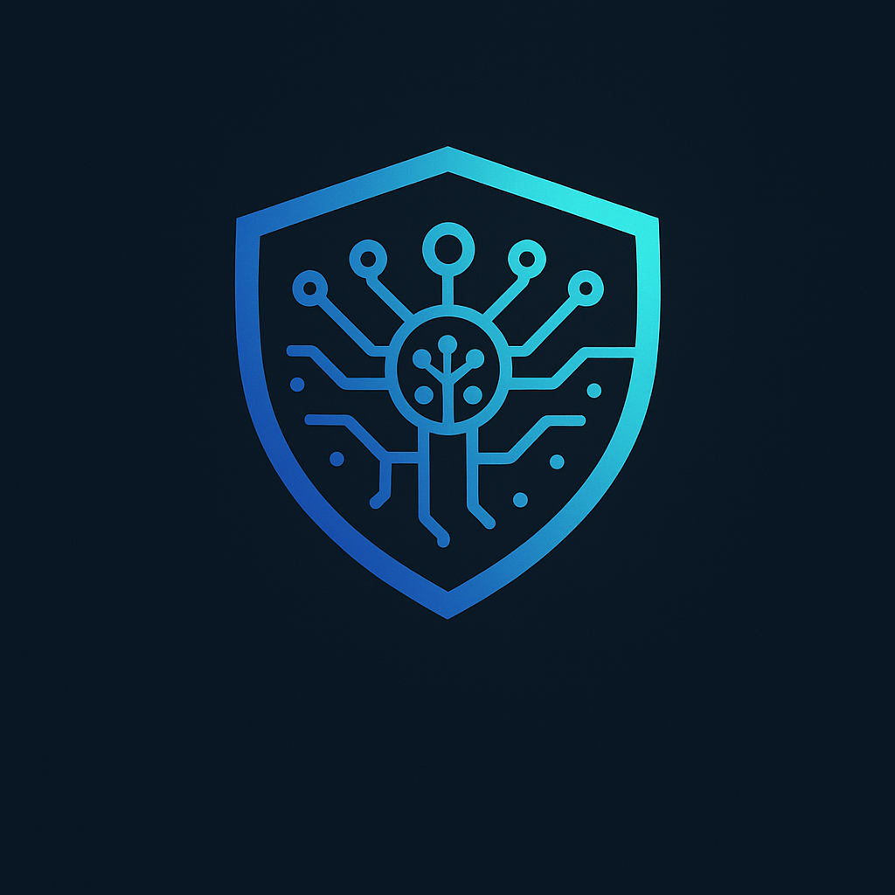

# Baruk AI: AI-Powered DeFi on Sei Network

  
**Simplifying DeFi with AI-driven automation and Web2-like ease.**

---

## 🧪 What is Baruk AI?

Baruk AI is the first AI-powered DeFi protocol built on the **Sei Network**, designed to make decentralized finance accessible, secure, and intuitive for everyone. Whether you're a Web3 veteran or a newcomer, Baruk combines the power of AI with Sei's high-performance blockchain to deliver a seamless DeFi experience. Our mission? Bring the simplicity of Web2 apps to Web3, so you can trade, stake, and invest without needing a PhD in blockchain.

---

## 🌟 Key Features

- **Autonomous Trading Agents**: AI-driven strategies to optimize trades and minimize risks.  
- **Scam & Rug Pull Protection**: Real-time detection to keep your funds safe.  
- **Smart Wallet Security**: 24/7 monitoring for account safety.  
- **One-Click DeFi**: Easy staking, lending, and investing with minimal effort.  
- **Cross-Protocol Integration**: Seamlessly interact with other Sei protocols.  
- **Personal AI Assistant**: A friendly guide explaining DeFi in plain, jargon-free language.

---

## 🛠️ What We're Building

At its core, Baruk AI is a trading protocol on Sei's fast and scalable network, enabling secure and efficient management of digital assets. We're fine-tuning **OpenAI's GPT-OSS model** on Sei blockchain data to create a native AI agent that understands the ecosystem and powers autonomous trading. With **Privy integration**, onboarding is as simple as signing up with an email or social account—no seed phrases or complex wallet setups required.

### Current Progress
- **Trading Protocol**: In development for fast, secure transactions on Sei.  
- **AI Agent**: Actively fine-tuning GPT-OSS for Sei-native intelligence.  
- **Privy Integration**: Simplifying sign-ups with account abstraction.  
- **Security & Risk Engine**: Designing real-time scam detection and loss minimization (in progress).

---

## 🎯 Why Baruk Matters

Baruk bridges the gap between Web2 usability and Web3 innovation. By combining AI automation, robust security, and a user-friendly interface, we're redefining DeFi on Sei. Whether you're a newbie or a pro, Baruk empowers you to engage with decentralized finance confidently, with an AI that’s got your back.

---

*Built for the future of DeFi. Powered by Baruk AI on Sei.*