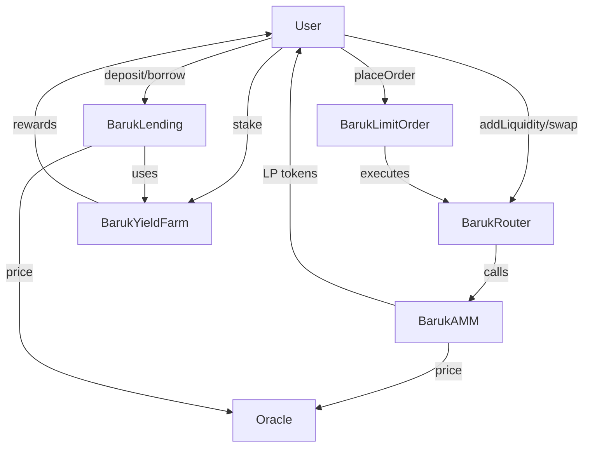

# Baruk Protocol Overview

Baruk is a modular DeFi protocol designed for security, composability, and extensibility. It features a robust AMM, lending, yield farming, and limit order system, all integrated with a secure oracle. The protocol is built to be hackathon-ready, with every calculation and logic branch documented and justified.

## Architecture

- **BarukAMM:** Automated Market Maker for permissionless swaps and liquidity provision.
- **BarukRouter:** User-friendly interface for adding/removing liquidity and swapping.
- **BarukYieldFarm:** Staking and rewards for LP tokens.
- **BarukLending:** Overcollateralized lending and borrowing.
- **BarukLimitOrder:** On-chain limit order execution.
- **Oracle Integration:** Secure price feeds for risk management and fair pricing.

## Design Philosophy

- **Security First:** Reentrancy protection, overflow checks, and explicit edge case handling.
- **Composability:** Each contract is designed to work seamlessly with others.
- **Transparency:** All calculations and logic are documented and justified.
- **Governance:** Key parameters are upgradable by governance, with clear controls.

## Contract Interactions

## Why Baruk?

- **Battle-tested patterns:** Inspired by Uniswap, Compound, and Synthetix, but with unique improvements.
- **Hackathon-ready:** Every calculation, check, and edge case is documented for judges and auditors.
- **Extensible:** Easy to add new modules or integrate with other DeFi protocols. 